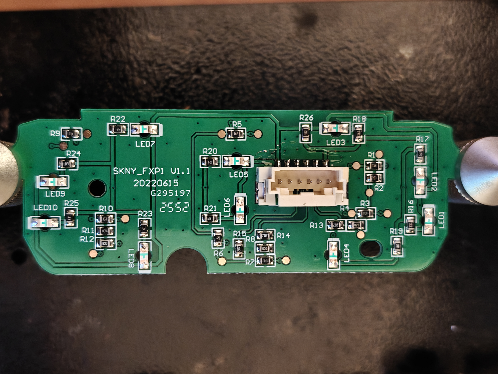
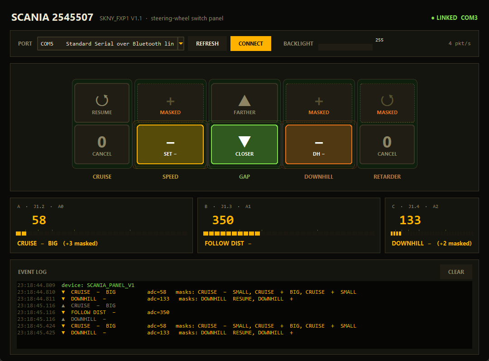
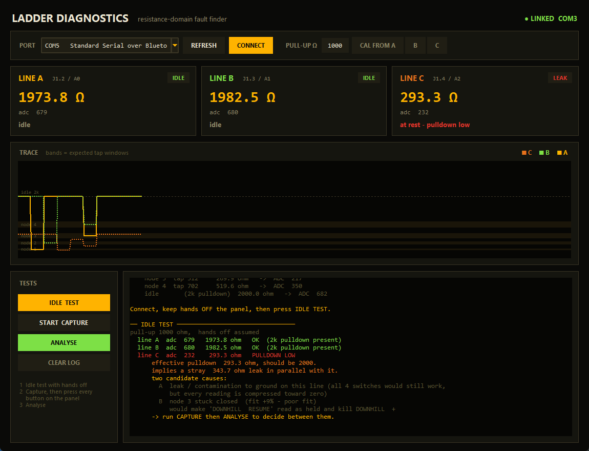

# Truck Steering-Wheel Switch Panel — Reverse Engineering


Complete reverse engineering of a truck steering-wheel cruise/retarder switch panel:
schematic, netlist, resistor values, connector pinout, and an Arduino + Python
toolchain that reads all twelve buttons.

The board identifies itself on the silkscreen as **`SKNY_FXP1 V1.1 / 20220615 / G295197`**.
It is sold as a replacement cruise-control switch module for Scania L/P/G/R/S-series
tractors (OEM reference 2545507).

> **Independent research.** Not affiliated with, authorised by, or endorsed by Scania
> or any vehicle manufacturer. Manufacturer and part numbers appear solely to identify
> which part was studied. Everything here was derived by measuring a unit purchased on
> the open market — no manufacturer documentation, firmware, or software was used or
> reproduced. The panel is entirely passive: resistors, LEDs, and switch contacts, with
> no firmware, encryption, or access control of any kind.



---

## What it is

A 12-button steering-wheel panel with white LED backlighting, connected to the truck by
a single 6-pin cable. Twelve buttons on three wires is achieved with **three analog
resistor ladders** — a very common automotive pattern, because it gets the wire count
down and gives open/short fault detection for free.

| | |
|---|---|
| Buttons | 12 (in five physical zones) |
| Backlight | 10× white LED, individually ballasted |
| Connector | Molex DuraClik, 6-pin (`560020-0620` footprint) |
| Signal wires | 3 analog ladder lines |
| Active components | none — fully passive |

---

## Connector pinout (J1)

| Pin | Function | Notes |
|-----|----------|-------|
| 1 | Backlight + | ~5 V dimmable illumination rail |
| 2 | Ladder A | cruise speed rocker (two-stage) |
| 3 | Ladder B | cruise resume/cancel + follow distance |
| 4 | Ladder C | downhill/retarder |
| 5 | Ground | |
| 6 | Backlight − | LED cathode common |

---

## How button detection works

Each signal line is an identical series ladder — **62 → 100 → 150 → 390 Ω** — with a
**2 kΩ pulldown** to ground. Every button shorts its own tap to ground, so each button
presents a distinct resistance at the connector pin.

```
J1 pin ──62Ω──┬──100Ω──┬──150Ω──┬──390Ω──┬
              │        │        │        │
             SW1      SW2      SW3      SW4          2kΩ pulldown
              │        │        │        │            to GND
             GND      GND      GND      GND
```

The 2 kΩ pulldown is what makes the scheme fault-tolerant: an unplugged connector or a
broken wire reads open-circuit, and a shorted harness reads ~0 Ω. Both are
distinguishable from every legitimate button state.

### Decode table

Resistance seen at the pin, and the resulting 10-bit ADC value with a **1 kΩ pull-up to
5 V** (the wiring used by the tools in this repo):

| Tap | Ladder | ∥ 2 kΩ | ADC | Line A (pin 2) | Line B (pin 3) | Line C (pin 4) |
|-----|--------|--------|-----|----------------|----------------|----------------|
| 1 | 62 Ω | 60 Ω | **58** | Cruise **−** BIG | Cruise **CANCEL** | Downhill **CANCEL** |
| 2 | 162 Ω | 150 Ω | **133** | Cruise **−** SMALL | Follow dist **+** | Downhill **−** |
| 3 | 312 Ω | 270 Ω | **217** | Cruise **+** BIG | Cruise **RESUME** | Downhill **RESUME** |
| 4 | 702 Ω | 520 Ω | **350** | Cruise **+** SMALL | Follow dist **−** | Downhill **+** |
| — | idle | 2 kΩ | **682** | — | — | — |
| — | open | ∞ | **1023** | fault | fault | fault |

### Physical layout

Five zones, left to right, twelve contacts total:

| Zone | Buttons | Line |
|------|---------|------|
| Cruise resume / cancel | 2 | B (taps 3, 1) |
| Cruise speed rocker | 4 — **two-stage**: light press = small step, firm = big step | A (all four) |
| Follow distance | 2 | B (taps 2, 4) |
| Downhill rocker | 2 | C (taps 2, 4) |
| Retarder resume / cancel | 2 | C (taps 3, 1) |

The cruise rocker is the only two-stage control, which is why one whole ladder is spent
on a single rocker.

---

## Simultaneous presses

Within a line the taps are a **series chain**, so grounding one tap shorts out every tap
beyond it. Holding two buttons on the same line produces a reading that is bit-for-bit
identical to holding the nearer-to-connector one alone — there is no signal to recover.

**Rule: the reported button is the lowest-index one held; everything past it is invisible.**

Enumerating all 2¹² combinations ([`tools/enumerate_combos.py`](tools/enumerate_combos.py) →
[`docs/button_combinations.csv`](docs/button_combinations.csv)):

```
total combinations      : 4096
fully observable        : 125
at least one masked     : 3971
distinct ADC signatures : 125   (5 states ^ 3 lines)
```

The three ladders are independent, so **up to 3 buttons — one per line — register
simultaneously**. That is the hard ceiling of the design, not a software limit.

---

## Backlight

Ten white LEDs sit in parallel between pin 1 and pin 6, each with its own ballast
resistor. The values are deliberately unequal — that is brightness balancing, so legends
behind heavier diffusers get more current and the panel looks even.

| LED | Ballast | Value | | LED | Ballast | Value |
|---|---|---|---|---|---|---|
| LED1 | R16 | 330 Ω | | LED6 | R21 | 680 Ω |
| LED2 | R17 | 680 Ω | | LED7 | R22 | 470 Ω |
| LED3 | R18 | 360 Ω | | LED8 | R23 | 390 Ω |
| LED4 | R19 | 300 Ω | | LED9 | R24 | 680 Ω |
| LED5 | R20 | 620 Ω | | LED10 | R25 | 330 Ω |

**R26 (3.9 kΩ)** bridges the rail with no LED — a bleeder that keeps the dimmer's
off-state leakage from ghost-lighting the panel.

The LEDs are a 5 mA white part (2.9 V forward drop typical). Working backwards from the
ballast values, **the illumination rail is ~5 V, not 24 V** — at 12 V the 330 Ω legs
would pull 27 mA and at 24 V over 60 mA, well beyond the die rating. Total panel draw is
about **47 mA** including R26. The truck regulates and PWM-dims this rail before it
reaches the wheel.

---

## Full resistor list

| Ref | Code | Value | Role | | Ref | Code | Value | Role |
|---|---|---|---|---|---|---|---|---|
| R1 | 391 | 390 Ω | ladder A tap 4 | | R14 | 202 | 2 kΩ | pulldown B |
| R2 | 151 | 150 Ω | ladder A tap 3 | | R15 | 202 | 2 kΩ | pulldown C |
| R3 | 1000 | 100 Ω | ladder A tap 2 | | R16 | 331 | 330 Ω | LED1 |
| R4 | 620 | 62 Ω | ladder A tap 1 | | R17 | 681 | 680 Ω | LED2 |
| R5 | 391 | 390 Ω | ladder B tap 4 | | R18 | 361 | 360 Ω | LED3 |
| R6 | 151 | 150 Ω | ladder B tap 3 | | R19 | 301 | 300 Ω | LED4 |
| R7 | 1000 | 100 Ω | ladder B tap 2 | | R20 | 621 | 620 Ω | LED5 |
| R8 | 620 | 62 Ω | ladder B tap 1 | | R21 | 681 | 680 Ω | LED6 |
| R9 | 391 | 390 Ω | ladder C tap 4 | | R22 | 471 | 470 Ω | LED7 |
| R10 | 151 | 150 Ω | ladder C tap 3 | | R23 | 391 | 390 Ω | LED8 |
| R11 | 1000 | 100 Ω | ladder C tap 2 | | R24 | 681 | 680 Ω | LED9 |
| R12 | 620 | 62 Ω | ladder C tap 1 | | R25 | 331 | 330 Ω | LED10 |
| R13 | 202 | 2 kΩ | pulldown A | | R26 | 392 | 3.9 kΩ | rail bleeder |

Note that many chips are mounted rotated 180°, so their codes read upside-down in
photographs — `189` on the board is a `681`. Several values were only settled by
rotating the image until neighbouring silkscreen read the right way up.

## Test points

Every ladder node is brought out to a test pad, which makes fault-finding easy:

| Node | Line A | Line B | Line C |
|------|--------|--------|--------|
| tap 1 | TP1, TP2 | TP8 | TP13 |
| tap 2 | TP3, TP6 | TP9 | TP12 |
| tap 3 | TP5 | TP7 | TP14 |
| tap 4 | TP4 | TP10 | TP11 |

---

## Using it with an Arduino

Six wires and three resistors:

| J1 pin | Arduino |
|--------|---------|
| 1 | 5 V |
| 2 | A0, **plus 1 kΩ from A0 to 5 V** |
| 3 | A1, **plus 1 kΩ from A1 to 5 V** |
| 4 | A2, **plus 1 kΩ from A2 to 5 V** |
| 5 | GND |
| 6 | GND, or a low-side MOSFET on D9 for PWM dimming |

**Do not use the internal pull-ups.** At ~35 kΩ they would squash every button below
0.1 V and make the four taps indistinguishable. The external 1 kΩ spreads the five
states across the ADC range with 75–330 counts between them — far more margin than the
ADC's noise floor.

Worst-case current is 4.7 mA per line, and the source impedance the ADC sees never
exceeds ~1 kΩ, comfortably inside the ATmega328P's 10 kΩ recommendation.

Flash [`firmware/panel_reader/panel_reader.ino`](firmware/panel_reader/panel_reader.ino).
It streams raw averaged ADC counts as `a,b,c` at ~60 Hz and deliberately does *not*
decode on-device, so thresholds can be retuned on the host without reflashing.

---

## Tools

```bash
pip install pyserial
python tools/panel_gui.py      # live monitor
python tools/panel_diag.py     # ladder fault finder
```

On Windows, `tools/install_shortcuts.ps1` creates desktop shortcuts, or use the
`.bat` launchers (which check for pyserial first).

**Panel monitor** — lights up a drawing of the real panel as buttons are pressed.
Buttons that are held but electrically masked are labelled as such rather than silently
ignored.



**Ladder diagnostics** — works in the resistance domain rather than raw ADC, converting
each reading back to ohms so a fault maps onto a physical node. It fits two competing
models (a stuck switch on a healthy 2 kΩ line, versus a leak dragging the pulldown down)
and reports which one the data actually supports.




https://github.com/user-attachments/assets/56d19fef-1fe3-4a56-b6b1-583ad4992691

---

## Repository layout

```
hardware/    KiCad 10 project — schematic, PCB, exported netlist
photos/      board photographs, plus PDFs with the traces drawn over
firmware/    Arduino sketch
tools/       Python monitor, diagnostics, combination enumerator
docs/        full combination table, screenshots
```

The `.kicad_pcb` is large (~31 MB) because it embeds the board photographs that were
used as tracing underlays while the copper was being followed.

## Method

1. Photograph both sides at high resolution under even lighting.
2. Draw over every visible trace in an image editor, working from the two PDFs in
   `photos/` — one per side, with the component-side image mirrored so pad positions
   line up between the two.
3. Transcribe to a KiCad schematic, then export the netlist and check it against the
   photos.
4. Read every resistor code, rotating crops so upside-down parts read correctly.
5. Verify electrically: measure each ladder node and confirm the predicted resistance.

The netlist was the useful cross-check throughout — the three ladders coming out
identical (62/100/150/390 + 2 kΩ) was strong evidence the trace-following was right, and
it caught two transcription errors that the photographs alone had not.

## License

Code and documentation: [MIT](LICENSE).

The measured electrical characteristics are facts about a physical object and are not
claimed as anyone's intellectual property. Photographs are original work by the
repository author.
